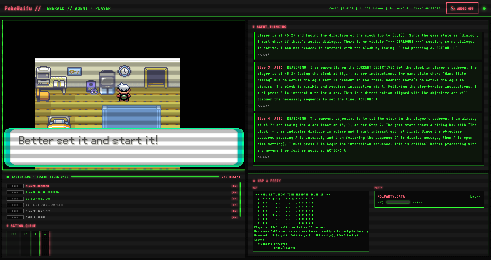

# PokéAgent Speedrun



> **Pokéthon Submission** - The first Poké-themed Hackathon by [CreatorBid](https://creator.bid/) × [Base](https://base.org/) ecosystem

An autonomous AI agent that plays Pokémon Emerald using vision-language models (VLMs). The agent perceives the game through screenshots, plans strategic actions, maintains contextual memory, and executes button inputs to progress through the game - all without human intervention.

## Hackathon Context

This project was built for **Pokéthon** - a hackathon dedicated to building AI Pokémon-inspired Agents, combining AI autonomy, collectibles, and real-world asset (RWA) integration within the Web3 ecosystem.

**Why This Fits Pokéthon:**
- **AI Autonomy**: Fully autonomous agent making decisions without human input
- **Pokémon-Inspired**: Built specifically for Pokémon Emerald speedrunning
- **Web3 Ready**: Architecture supports on-chain integration and tokenized agent ownership
- **Collectible Potential**: Each trained agent instance can have unique strategies and personalities
- **RWA Integration**: Agent performance metrics can be tied to real-world value through CreatorBid's launchpad

## Table of Contents

- [Hackathon Context](#hackathon-context)
- [Key Features](#key-features)
- [Quick Start](#quick-start)
- [Architecture](#architecture)
- [Installation](#installation)
- [VLM Backend Setup](#vlm-backend-setup)
- [Running the Agent](#running-the-agent)
- [Agent Scaffolds](#agent-scaffolds)
- [Customizing Agent Behavior](#customizing-agent-behavior)
- [Technical Details](#technical-details)
- [License](#license)

## Key Features

| Feature | Description |
|---------|-------------|
| **Multi-VLM Support** | OpenAI GPT-4o, Google Gemini, Claude, and local HuggingFace models |
| **Vision-Based Perception** | Analyzes game frames using state-of-the-art VLMs |
| **Strategic Planning** | Multiple agent scaffolds (Simple, ReAct, Four-Module) |
| **Persistent Memory** | Tracks objectives, action history, and progress across sessions |
| **A* Pathfinding** | Advanced navigation with collision detection and NPC avoidance |
| **Real-Time Streaming** | Web interface for live visualization at `localhost:8000/stream` |
| **Checkpoint System** | Save/restore progress for long-running speedrun attempts |
| **Video Recording** | Automatic MP4 recording for submission verification |

## Quick Start

```bash
# 1. Install dependencies
curl -LsSf https://astral.sh/uv/install.sh | sh
uv sync && source .venv/bin/activate

# 2. Install mGBA (macOS)
brew install mgba

# 3. Set API key
export GEMINI_API_KEY="your-key-here"

# 4. Run the agent
python run.py --scaffold simple --agent-auto --backend gemini
```

Watch the agent play at: **http://localhost:8000/stream**

## Architecture

```
┌─────────────────────────────────────────────────────────────┐
│                    PokéAgent Speedrun                       │
├─────────────────────────────────────────────────────────────┤
│                                                             │
│  ┌─────────────────┐          ┌─────────────────┐          │
│  │  Server Process │◀────────▶│  Client Process │          │
│  │  (mGBA Emulator)│   HTTP   │   (AI Agent)    │          │
│  └────────┬────────┘          └────────┬────────┘          │
│           │                            │                    │
│           ▼                            ▼                    │
│    ┌─────────────┐            ┌─────────────────┐          │
│    │ Game State  │            │   VLM Backend   │          │
│    │ Screenshots │            │ (Gemini/GPT-4o) │          │
│    └─────────────┘            └─────────────────┘          │
│                                                             │
└─────────────────────────────────────────────────────────────┘
```

**Data Flow:**
1. Server captures game state and screenshots from emulator
2. Client requests state via HTTP API
3. Agent formats state for LLM processing
4. VLM analyzes frame and decides next action
5. Action sent back to server for execution
6. Repeat continuously for autonomous gameplay

## Technical Details

<details>
<summary><strong>Directory Structure</strong></summary>

```
pokeagent-speedrun/
├── run.py                   # Main entry point
├── agent/                   # Agent architectures (customize here!)
│   ├── system_prompt.py     # Core agent personality
│   ├── simple.py            # Lightweight agent scaffold
│   ├── react.py             # ReAct reasoning agent
│   └── perception.py        # Four-module perception
├── server/                  # Emulator server & web UI
│   ├── app.py               # FastAPI server
│   └── stream.html          # Live streaming interface
├── utils/                   # Utilities
│   ├── vlm.py               # VLM backends (OpenAI, Gemini, etc.)
│   ├── pathfinding.py       # A* navigation
│   └── map_*.py             # Map visualization
├── pokemon_env/             # mGBA emulator integration
│   └── memory_reader.py     # Game state reader (DO NOT MODIFY)
└── Emerald-GBAdvance/       # ROM and save states
```

</details>

## Requirements

- **Python**: 3.10 - 3.11
- **ROM**: Pokémon Emerald (obtain legally, place at `Emerald-GBAdvance/rom.gba`)
- **VLM API Key**: Gemini, OpenAI, or OpenRouter

## Installation

```bash
# Clone and setup
git clone https://github.com/sethkarten/pokeagent-speedrun
cd pokeagent-speedrun

# Install uv and dependencies
curl -LsSf https://astral.sh/uv/install.sh | sh
uv sync
source .venv/bin/activate

# Install mGBA emulator
# macOS:
brew install mgba

# Ubuntu:
wget https://github.com/mgba-emu/mgba/releases/download/0.10.5/mGBA-0.10.5-ubuntu64-focal.tar.xz
tar -xf mGBA-0.10.5-ubuntu64-focal.tar.xz
sudo dpkg -i mGBA-0.10.5-ubuntu64-focal/libmgba.deb

# Place ROM at Emerald-GBAdvance/rom.gba
```

## VLM Backend Setup

| Backend | API Key | Command |
|---------|---------|---------|
| **Gemini** (recommended) | `GEMINI_API_KEY` | `python run.py --backend gemini --model-name gemini-2.5-flash` |
| **OpenAI** | `OPENAI_API_KEY` | `python run.py --backend openai --model-name gpt-4o` |
| **OpenRouter** | `OPENROUTER_API_KEY` | `python run.py --backend openrouter --model-name anthropic/claude-3.5-sonnet` |
| **Local** | None | `python run.py --backend local --model-name Qwen/Qwen2-VL-2B-Instruct` |

```bash
# Set your API key
export GEMINI_API_KEY="your-key-here"
```

## Running the Agent

```bash
# Basic run (autonomous mode)
python run.py --agent-auto --backend gemini

# Production speedrun (recommended)
python run.py --record --scaffold simple --no-ocr --agent-auto --backend gemini

# With video recording
python run.py --record --agent-auto

# Headless mode (no display)
python run.py --headless --agent-auto

# Load from saved state
python run.py --load-state Emerald-GBAdvance/start.state --agent-auto
```

### Keyboard Controls (when display is enabled)

| Key | Action |
|-----|--------|
| `Space` | Trigger single agent step |
| `Tab` | Toggle agent/manual mode |
| `A` | Toggle auto-agent mode |
| `M` | Show LLM state info |
| `S` | Save screenshot |
| Arrow Keys | Manual movement |

## Agent Scaffolds

Choose from different agent architectures via `--scaffold`:

| Scaffold | Description | Command |
|----------|-------------|---------|
| **simple** | 3-5x faster, direct frame→VLM→action | `--scaffold simple` |
| **fourmodule** | Perception→Planning→Memory→Action (default) | `--scaffold fourmodule` |
| **react** | ReAct pattern with explicit reasoning | `--scaffold react` |
| **claudeplays** | Tool-based with A* pathfinding | `--scaffold claudeplays` |

```bash
# Recommended: Simple mode for speedrunning
python run.py --scaffold simple --agent-auto --backend gemini
```

## Customizing Agent Behavior

The agent behavior is controlled by prompts in the `agent/` directory:

| File | Purpose |
|------|---------|
| `agent/system_prompt.py` | Core agent personality and goals |
| `agent/simple.py` | Simple scaffold logic |
| `agent/perception.py` | How the agent interprets game state |
| `agent/planning.py` | Strategic planning behavior |
| `agent/action.py` | Decision-making for button inputs |

### Example: Speedrunner Personality

```python
# agent/system_prompt.py
system_prompt = """
You are an expert Pokémon Emerald speedrunner. Your goal is to beat the game
as quickly as possible using optimal strategies, routing, and tricks.
"""
```

## Web Interface

Access the live game stream and agent status at:

**http://localhost:8000/stream**

Features:
- Real-time game visualization
- Agent decision logging
- Performance metrics

## Troubleshooting

| Issue | Solution |
|-------|----------|
| Module not found | `uv sync && export PYTHONPATH="${PYTHONPATH}:$(pwd)"` |
| Out of memory | Use cloud VLM: `--backend gemini` |
| Web interface down | Check port 8000 is available |
| API rate limits | Use OpenRouter or local models |

## License

MIT License - see [LICENSE](LICENSE) for details.

---

**Built for Pokéthon 2024** | [CreatorBid](https://creator.bid/) × [Base](https://base.org/)
